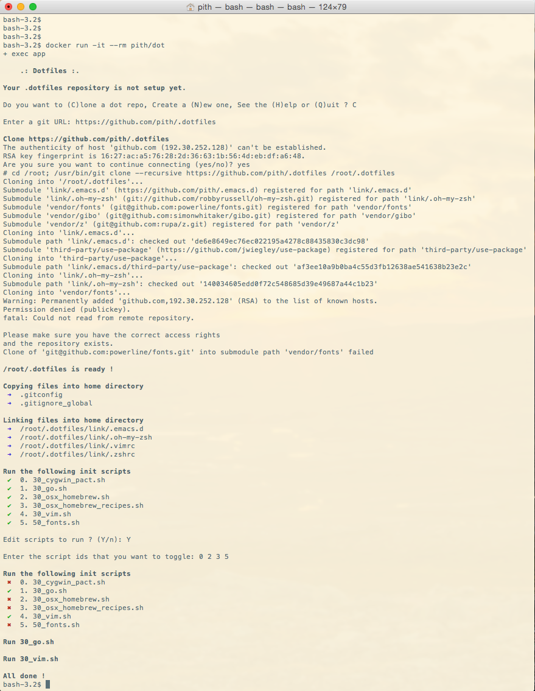

dotfiles  
========

Managing your dotfiles around multiple machine can be a pain. That's why a lot of initiatives came up to fix this. Most of them are listed in the [unofficial guide to dotfiles on GitHub](https://dotfiles.github.io/). But what I miss in these projects is a portable (I mean, whithout requiring any dependency) dotfiles manager, separated from its creator's dotfiles config. I want it to be platform and shell independent. And I want to be able to pull updates from this manager whitout pulling someone else config.

That's why I started this project based on the great work of [cowboy](https://github.com/cowboy/dotfiles). The goal here is to have a single dotfiles binary written in Go, doing all the dotfiles managing stuff for you.

**State of the project**: This project is actively developed, but is not ready yet. All the contributions are welcomed (issues like patchs). Run this script at your own risks !

## Install

Since it is not released yet, you can only get it from source and it requires you have a Go environment setup. The rest is pretty simple:

    go get github.com/pith/dotfiles

## Usage

Be sure to have the dotfiles command in your path, then run it.

The dotfiles command provides few conventions to help you manage your dotfiles.
If your dotfiles config is not setup the command will ask you if you want to
clone an existing Git directory or creating a new config from scratch. The new
config will look like this:

    ~/.dotfiles
      |_ bin
      |_ conf
      |_ copy
      |_ init
      |_ link
      |_ test
      |_ source
      |_ vendor
    
**Copy**

All the files under the copy dir are copyed in the home directory. The first time,
if the files already exist they will be backed up in the .dotfiles/backup directory.
After if the files are different they will be copyied again.

**Link**

Same thing as for the copy directory, but the files will be linked.

**Init**

The command will prompt a menu to select the scripts to execute. If the scripts have
been already run, they will be disable by default.

**Source**

The files in the source directory should be sourced by the .zshrc (or .bashrc 
depending on your favorite shell). This should not do more than that.

## Test your config with Docker

Before running the dotfiles command to setup your config, be sure to run it first.
The easiest way to do it is by running the `dotfiles` command in a Docker container
as follows.

Build the image:

    docker build -t yourname/dot .

Then run it:

    docker run -it --rm yourname/dot

## Shorcut

The first time you can pass a Git URL to the dotfiles command to directly clone it
without waiting the command to prompt the options.

## Screenshot

## Copyright and license
This source code is copyrighted by Pierre THIROUIN and released under the terms of the [Mozilla Public License 2.0](LICENSE).
